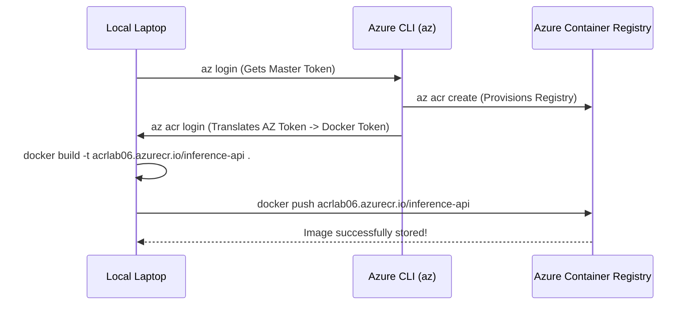

# 02 - Azure Container Registries (ACR) & Artifacts Lab

This lab focuses on provisioning a secure Azure Container Registry (ACR), building a Python Inference API container, and securely pushing it to the cloud.

---

## Visual Flow



---

## Step-by-Step Lab Guide

**0. Pre-flight Checks**
Before provisioning, check your current context and resource groups:
```bash
az account show -o table
az group list -o table
```

**1. Create the Azure Container Registry**
Provision your secure cloud locker. Remember, the name must be strictly lowercase, alphanumeric, and globally unique!
```bash
az acr create --resource-group container-learning --name <your-unique-name> --sku Basic
```

**2. Authenticate your Local Docker Client**
Get the temporary token so Docker can talk to Azure securely. (Ensure Docker Desktop is running first!)
```bash
az acr login --name <your-unique-name>
```

**3. Build the Image**
First, ensure you are in the correct directory. Then package your Python code. Don't forget the `.` at the end (the build context)!
```bash
cd 02-acr-registries-artifacts-lab

# For Student/Free subscriptions (Local Build):
docker build -t <your-unique-name>.azurecr.io/inference-api:v1.0.0 .

# For Pay-As-You-Go/Enterprise (Cloud Build):
az acr build --registry <your-unique-name> --image inference-api:v1.0.0 .
```

**4. Push to the Cloud (If you did a Local Build)**
Ship it to Azure!
```bash
docker push <your-unique-name>.azurecr.io/inference-api:v1.0.0
```

**5. Verify the Artifact**
Confirm it is sitting safely in the registry.
```bash
az acr repository list --name <your-unique-name> -o table
```

---

## The Commands (Cheat Sheet)

| Command | What it does & Why it matters |
| :--- | :--- |
| `az group list -o table` | Lists all resource groups. `-o table` prevents a massive JSON wall of text. Essential for exams/prod. |
| `az acr list -o table` | Lists all registries across your subscription. |
| `az acr create -g <rg> -n <name> --sku Basic` | Provisions the ACR. `Basic` is the cheapest tier. |
| `az acr login -n <name>` | Bridges Azure Identity with your local Docker CLI so you can push/pull securely. |
| `az acr build -r <name> -t <image> .` | **Cloud Build:** Sends code to Azure to build (bypassing local Docker). |
| `docker build -t <registry-url>/<image> .` | **Local Build:** Builds locally. Must be prefixed with the ACR URL so Docker knows where to route the push. |
| `az acr repository list -n <name> -o table` | Verifies the container image actually made it into the registry. |

---

## The Errors We Hit (And Why)

The best way to learn is by breaking things. Here is exactly what went wrong during this lab and why (highly relevant for debugging in prod and the exam).

### 1. The Naming Errors
* **Error:** `argument error: Registry name must use only lowercase.`
* **Error:** `(AlreadyInUse) The registry DNS name acrlab.azurecr.io is already in use.`
* **Why it happens:** ACR names become public DNS URLs (`<name>.azurecr.io`). Therefore, they must be strictly lowercase, alphanumeric, and globally unique across the entire planet.

### 2. The Docker Daemon Error
* **Error:** `Cannot connect to the Docker daemon at unix:///Users/.../docker.sock.`
* **When:** Running `az acr login`.
* **Why it happens:** `az acr login` tries to inject a token into your local Docker client. If Docker Desktop is closed, the Azure CLI crashes because it has nowhere to put the token. Fix: Start Docker Desktop.

### 3. The Cloud Build Block (TasksOperationsNotAllowed)
* **Error:** `ACR Tasks requests for the registry acrlab06 and <subscription> are not permitted.`
* **When:** Running `az acr build`.
* **Why it happens:** Bad actors were abusing Azure Free/Student accounts to mine crypto using Azure's free build VMs. Microsoft blocked `az acr build` on Student subscriptions by default. 
* **The Fix:** Fallback to building locally (`docker build`) and pushing (`docker push`).

### 4. The Missing Build Context
* **Error:** `'docker buildx build' requires 1 argument`
* **When:** Running `docker build -t acrlab06.azurecr.io/inference-api`
* **Why it happens:** You forgot the trailing `.` at the end of the command. Docker needs to know *where* the Dockerfile is located. The `.` means "my current directory".

### 5. The VPN / Proxy Timeout (The Invisible Wall)
* **Error:** `proxyconnect tcp: dial tcp 192.168.65.1:3128: i/o timeout`
* **When:** Running `docker push`, right at the very end.
* **Why it happens:** The image built perfectly, but Docker Desktop's internal network gateway (`192.168.65.1`) got confused or blocked by a VPN/Proxy on the host machine. 
* **The Fix:** Disconnect VPNs or simply restart Docker Desktop on your Mac.

---

## Exam & Production Takeaways

1. **You don't need passwords for ACR.** You should almost never enable the "Admin User" (which gives a static password). In prod, always use Azure AD / Entra ID (`az acr login` or Managed Identities).
2. **Tokens expire.** The token generated by `az acr login` only lasts for 3 hours. If you leave your laptop and come back, you don't need to `az login` again, but you will need to `az acr login` again.
3. **Tags are routing addresses.** When you tag an image `acrlab06.azurecr.io/inference-api`, you are explicitly telling the Docker client to ignore Docker Hub and route the traffic to your Azure registry.
