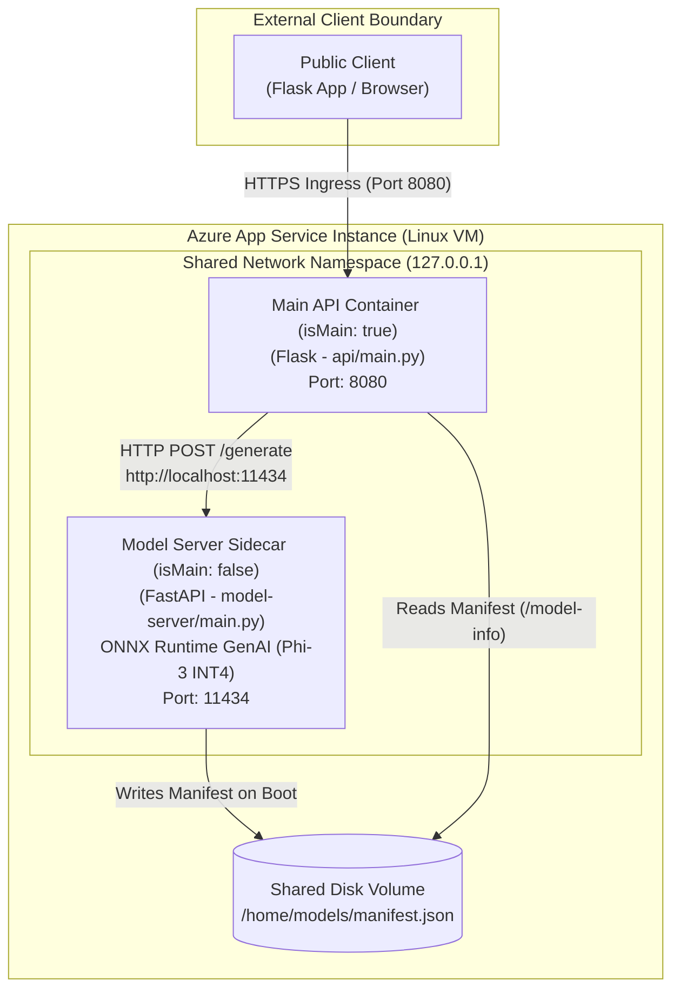

## Overview

An **Azure App Service sidecar** is an auxiliary container that runs in the same environment as the main Linux app container. Sidecars add capabilities such as local AI inference, telemetry collection, or caching without placing those capabilities inside the main application image.

> [!NOTE]
> Sidecar availability can vary for App Service Environment (ASE) deployments and national clouds. Always verify the latest [App Service sidecar limitations](https://learn.microsoft.com/en-us/azure/app-service/overview-sidecar#are-there-any-limitations) before choosing this pattern for isolated or national cloud environments.

---

## 1. The Sidecar Execution Model

A sidecar-enabled Web App has **one main container** and can host **up to nine sidecar containers** (up to 10 containers total per instance).

App Service manages all containers as **one unified application**, but each container maintains:
- Its own container image (e.g., ACR or Docker Hub repository)
- Its own startup command / entrypoint
- Its own container-specific environment variables and volume mounts



```json
// Main Container (Exposes public HTTP endpoint)
{
  "name": "main-api",
  "properties": {
    "isMain": true
  }
}

// Sidecar Container (Internal network reachability only)
{
  "name": "model-server",
  "properties": {
    "isMain": false
  }
}
```

### Container Roles & Traffic Routing

| Property | Setting | Public HTTP Routing | Reachable Via | Purpose |
| :--- | :--- | :--- | :--- | :--- |
| `isMain: true` | **Main Container** |  Yes (App Service ingress) | External Domain / Ingress | Serves customer requests (e.g. FastAPI backend) |
| `isMain: false` | **Sidecar Container** | ❌ No | `localhost:<port>` | Local support (AI inference, caching, logging) |

> [!IMPORTANT]
> **Exactly one container** in an App Service app must set `"isMain": true`. All supporting sidecars MUST set `"isMain": false`.

---

## 2. Lifecycle Coupling & Scaling Behavior

Sidecars follow the lifecycle of the main app instance:

1. **Synchronized Boot & Shutdown**: App Service starts and stops all containers on an instance as part of the same application lifecycle.
2. **Scale-Out**: When your App Service Plan scales out (e.g., from 1 instance to 3 instances), **each new VM instance receives the main container and all configured sidecars**.
3. **Scale-In**: When scaling in, App Service removes the complete set of containers on that instance.
4. **Independent Container Deployment**: You can update a sidecar container image independently of the main image without re-building the main application image, but the updated container configuration still belongs to the same app resource.

### Why This Matters for Conversational AI & SLMs
Every API instance automatically gets its own **local model server** on `localhost`. Your API code does not need complex service discovery or dynamic endpoint load balancing to talk to its inference engine—it simply connects to `http://localhost:<sidecar-port>`.

---

## 3. Network Isolation & Security Boundaries

Sidecars share the main app's **network namespace** and host environment. 

- **Local Communication**: A sidecar can directly reach any exposed TCP/UDP port of other containers on `localhost`.
- **Latency & Auth**: Eliminates cross-network HTTP hops and simplifies authentication (no public internet boundary between API and inference server).
- **Trust Boundary**: Because all containers share the same network namespace and host VM, **run only trusted container images**. A compromised sidecar shares the trust boundary of the main app.

---

## 4. Configuration Model: Classic vs. `sitecontainers`

Sidecar-enabled apps use the **`sitecontainers` configuration model**. Each container is represented by a `Microsoft.Web/sites/sitecontainers` resource, and the parent Web App sets `LinuxFxVersion = sitecontainers`.

```
Classic Single Container / Docker Compose               Modern Sidecar Resource Model
-----------------------------------------               -----------------------------
LinuxFxVersion: DOCKER|<image>             -->          LinuxFxVersion: sitecontainers
App Settings: WEBSITES_PORT                             Resource: Microsoft.Web/sites/sitecontainers
App Settings: DOCKER_REGISTRY_SERVER_*                  (Port & Auth configured per container resource)
```

> [!WARNING]
> Converting an existing custom-container app to sidecar configuration changes how container settings are stored. Classic app settings like `WEBSITES_PORT` and `DOCKER_REGISTRY_SERVER_*` **do not apply** to sidecar containers.

---

## 5. Capacity Planning & Resource Boundaries

All containers running on an app instance consume compute capacity from the **same underlying App Service Plan**.

### Planning Steps for AI Workloads:
1. **Model Loading Baseline**: Measure memory required by the AI inference sidecar (e.g., Ollama loading Phi-3 into RAM) before serving any traffic.
2. **Concurrency Peak**: Measure CPU and memory for both the main API and sidecar under peak concurrent request load.
3. **Startup Overlap**: Factor in container startup overlap during deployments and auto-scale events.
4. **Select Plan Tier**: Choose an App Service Plan SKU (e.g. Premium v3 / Memory Optimized) that provides sufficient RAM + CPU headroom for both containers combined.

---

## 6. AI-200 Exam Decision Matrix: Sidecar vs. Dedicated Microservice

Use this comparison matrix to answer architecture and exam scenario questions:

| Evaluation Criteria | Choose App Service Sidecar | Choose Separate Dedicated Hosting (Container Apps / Azure ML / Azure OpenAI) |
| :--- | :--- | :--- |
| **Usage Pattern** | Model server serves **only 1 main app instance** | Multiple applications share **one centralized model endpoint** |
| **Hardware** | Fits within standard CPU/RAM of an App Service Plan | Requires dedicated GPU hardware or high-VRAM SKU |
| **Scaling Needs** | Sidecar scales **1:1** with Web App traffic | Model server needs independent auto-scaling (e.g., GPU usage / queue depth) |
| **Latency Boundary** | Minimal latency required (in-process / `localhost` loopback) | Network latency over VNet / Private Endpoint is acceptable |
| **Zero-Scale Requirement** | Main app and sidecar run continuously | Component needs to scale to zero (0 instances) when idle |
| **Trust Boundary** | Main app and sidecar share host VM & trust boundary | Component requires strict microservice security boundary |

---

## Summary Checklist

- [x] **Main Container (`isMain: true`)**: Handles incoming public HTTP traffic.
- [x] **Sidecar Container (`isMain: false`)**: Reached internally via `localhost:<port>`. Max 9 sidecars.
- [x] **Resource Provider**: Managed via `Microsoft.Web/sites/sitecontainers` with `LinuxFxVersion = sitecontainers`.
- [x] **Scaling**: Scales 1:1 with Web App instance count.
- [x] **Hardware**: Shares App Service Plan CPU and Memory footprint.

