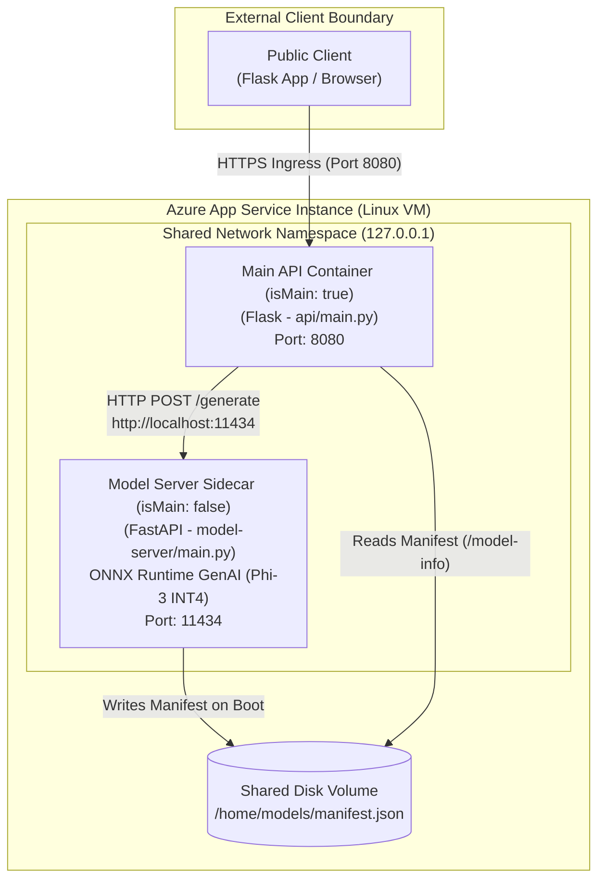

## Overview

In this lab, you will learn how to design, configure, and deploy **sidecar-enabled AI applications** on **Azure App Service**. 

An Azure App Service **sidecar** is an auxiliary container running in the exact same Linux virtual machine instance alongside your main application container. This architectural pattern allows you to run local AI model inference engines (such as Ollama, Text Embeddings Inference, or Small Language Models), telemetry collectors, or caching layers without bloating your main application image.

---

## Architectural Pattern: Main vs. Sidecar Containers


+-----------------------------------------------------------------------------------+
|                        Azure App Service Instance (Linux VM)                      |
|                                                                                   |
|  +-----------------------------------------------------------------------------+  |
|  |                       Shared Network Namespace (localhost)                  |  |
|  |                                                                             |  |
|  |  +-------------------------+         +-----------------------------------+  |  |
|  |  |     Main Container      |         |         Sidecar Container         |  |  |
|  |  |      (isMain: true)     |  HTTP   |          (isMain: false)          |  |  |
|  |  |                         |-------->|                                   |  |  |
|  |  |   FastAPI / Express App |         |   AI Model Server (Ollama / TEI)  |  |  |
|  |  |   Exposes Port 8080     |         |   Internal Port 11434             |  |  |
|  |  +-------------------------+         +-----------------------------------+  |  |
|  +-----------------------------------------------------------------------------+  |
+-----------------------------------------------------------------------------------+
                                           ^
                                     Public Internet
                               (Routed ONLY to Main)
```

---

## What You Will Learn

1. **Choosing the Sidecar Pattern**: Evaluate coupling, shared network namespaces, lifecycle synchronization, and when to choose sidecars vs. dedicated microservices (Azure Container Apps / Azure OpenAI).
2. **Configuration Model**: Transition from classic single-container (`DOCKER|<image>`) to the modern `Microsoft.Web/sites/sitecontainers` resource model.
3. **Capacity & Resource Limits**: Perform capacity planning across shared CPU and memory resources on an App Service Plan.
4. **Resilient Inter-Container Networking**: Configure `httpx` timeouts, readiness probes (`/health/ready`), and atomic file writing over `/home`.
5. **Boundary Troubleshooting**: Diagnose deployment metadata, managed identity image pulls, process startup exits, and memory pressure.

---

## Lab Units

- [01 - Choose the App Service Sidecar Pattern](./01-choose-sidecar-pattern)

- [02 - Configure Main and Sidecar Containers](./02-configure-main-and-sidecars)
- [03 - Connect Containers and Share Files](./03-connect-containers-and-share-files)
- [04 - Diagnose Sidecar Failures](./04-diagnose-sidecar-failures)
