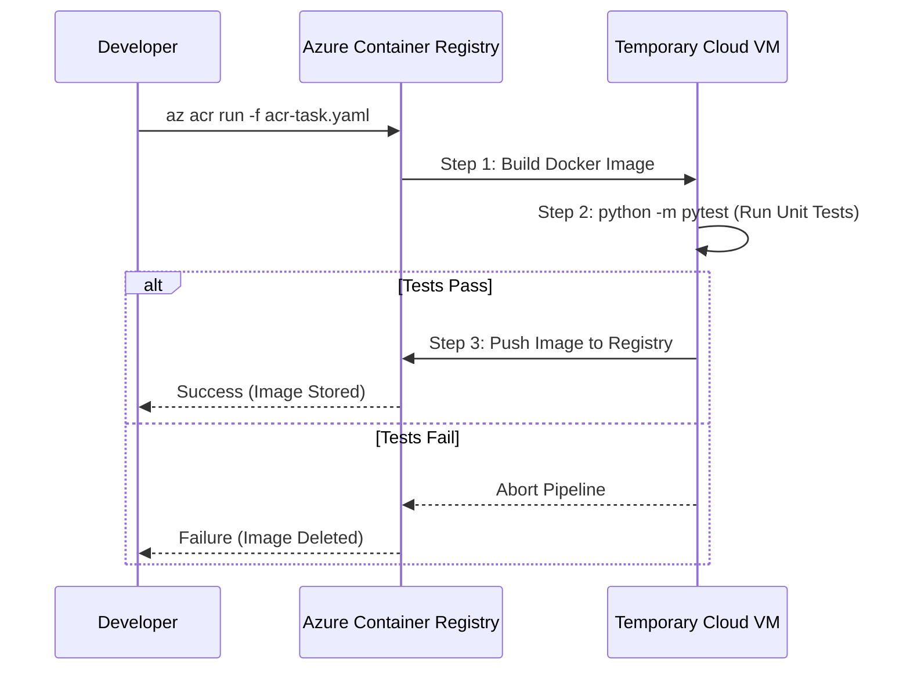

# 03 - Azure Container Registry (ACR) Tasks & CI/CD Lab

This lab is where we stop doing things manually and start thinking like an Enterprise Cloud Engineer. We are moving from "building a Docker image on my laptop" to "teaching Azure how to build, test, and deploy our code automatically."

---

## Visual Flow (The Multi-Step Pipeline)




---

## The Core Concepts (Deep Dive)

### 1. Quick Tasks (The Manual Cloud Build)
**What it is:** A way to build Docker images without using your local Docker engine.
**Why it matters:** It eliminates the "it worked on my machine" problem. If your laptop is slow, or you don't even have Docker installed, you can still build and push an image.
**How it works:** When you run `az acr build`, the Azure CLI zips up your current directory (the "context"), sends it to Azure, spins up a temporary high-power VM, builds the image in the cloud, pushes it directly into your registry, and then deletes the VM.
**The Command:**
```bash
az acr build --registry acrlab06 --image inference-api:v1.0.0 .
```
*(Pro-tip: You can even point it at a GitHub URL instead of a local directory, and Azure will pull the code directly from GitHub!)*

### 2. Automatically Triggered Tasks (The "Hands-Free" CI/CD)
Quick tasks still require you to type a command. Triggered tasks tell Azure to sit and watch for changes, then build automatically.

**A. Source Code Triggers (The Git Push)**
* **The Concept:** Connect your ACR to your GitHub repository.
* **How it works:** You give ACR a Personal Access Token (PAT). ACR creates a Webhook in GitHub. The second you type `git push origin main` on your laptop, GitHub pings Azure. Azure instantly wakes up, grabs the new code, and builds the new container. 

**B. Base Image Triggers (The Security Lifesaver - EXAM FOCUS)**
* **The Concept:** Automatic OS patching. 
* **How it works:** Look at our Dockerfile: it starts with `FROM python:3.11-slim`. If a critical hacker vulnerability is found in Python tomorrow, the Python team will push a patched `3.11-slim` image to Docker Hub. ACR actively monitors Docker Hub. The instant it detects that the base image changed, ACR automatically rebuilds your application on top of the new, secure OS, and pushes the updated image to your registry. You don't have to lift a finger.

**C. Scheduled Triggers (The Cron Job)**
* **The Concept:** Running builds on a timer.
* **How it works:** You tell Azure `az acr task create --schedule "0 0 * * *"`. Every night at midnight, Azure rebuilds the code. Perfect for giving the QA team fresh daily builds.

### 3. Multi-Step Tasks (The Full Pipeline)
**What it is:** A sequence of commands defined in a YAML file (`acr-task.yaml`).
**Why it matters:** If Azure automatically builds and pushes every time you type `git push`, what happens if your code is broken? You just automatically broke production!
**How it works:** Instead of just building blindly, you define a pipeline:
1. **Build:** Compile the image.
2. **Test:** Spin up the container and run `pytest`. This acts as a CI/CD Gatekeeper.
3. **Push:** ONLY push if the tests pass. If the tests fail, the pipeline immediately aborts and deletes the image.

---

## Step-by-Step Lab Guide

**Note on Azure Student Subscriptions:** 
Commands that require cloud compute VMs (`az acr run` and `az acr build`) are blocked on Free/Student tiers (`TasksOperationsNotAllowed`) to prevent crypto-mining abuse. To practically understand how the YAML pipeline works, we simulate the 3 steps locally.

**Step 1: Build the Image (Simulating YAML Step 1)**
```bash
docker build -t acrlab06.azurecr.io/inference-api:task-test .
```

**Step 2: Run the Unit Tests INSIDE the Container (Simulating YAML Step 2)**
This is the CI/CD Gatekeeper. We spin up the container we just built and execute `pytest` inside of it.
```bash
docker run --rm acrlab06.azurecr.io/inference-api:task-test python -m pytest tests/
```
*If this fails, you fix the code and start over. You DO NOT push.*

**Step 3: Push the Validated Artifact (Simulating YAML Step 3)**
Because the tests passed with `[100%]`, the pipeline authorizes the final push.
```bash
docker push acrlab06.azurecr.io/inference-api:task-test
```

---

## The Errors We Hit (And Why)

### 1. The ModuleNotFoundError (PyTest Pathing)
* **Symptom:** Running `docker run ... pytest tests/` returned Exit Code 2 and failed the pipeline.
* **Evidence:** The logs showed `ModuleNotFoundError: No module named 'app'` inside `tests/test_app.py`.
* **Hypothesis:** The container runs the global `pytest` binary from `/usr/local/bin/pytest`. Because it runs globally, Python does not append the current working directory (`/app`) to `sys.path`. Therefore, the test script has no idea where `app.py` is located.
* **The Fix:** Change the command to `python -m pytest tests/`. Executing it as a Python module forces Python to inject the current directory into the path, instantly fixing the import error.

### 2. The Cloud Compute Block
* **Symptom:** `TasksOperationsNotAllowed - ACR Tasks requests for the registry are not permitted.`
* **When:** Running `az acr run -f acr-task.yaml .`
* **The Fix:** Understand that Microsoft blocks compute on student accounts. Fall back to simulating the pipeline locally to learn the CI/CD logic.

---

## Essential Production Takeaways

1. **Layer Caching Strategy:** Open the `Dockerfile`. Notice that we copy `requirements.txt` and run `pip install` BEFORE we copy `app.py`. Why? Docker caches layers. If you change a single line of Python code in `app.py`, Docker will reuse the cached `pip install` layer. This drops your build time from 2 minutes down to 3 seconds.
2. **Fail-Fast Pipelines:** Running tests *inside* the container image before pushing it is the industry standard. It guarantees that the exact environment you tested is the exact environment being deployed.
