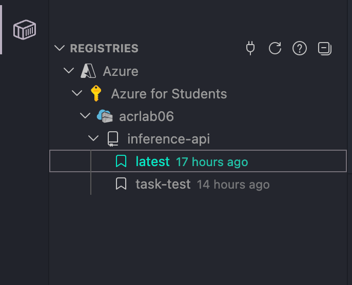
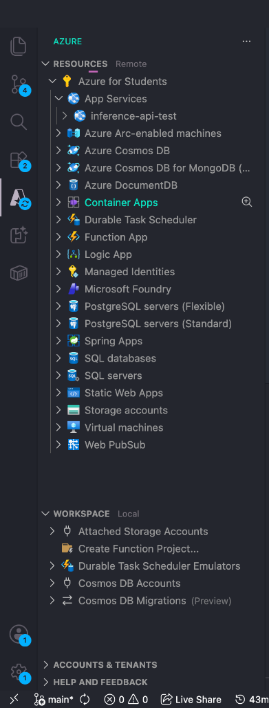

# 03 - Deploying Containers to Azure App Service

## Visual Flow & Architecture


Instead of manually configuring Virtual Machines, OS updates, and web servers, Azure App Service on Linux lets you deploy containerized applications effortlessly while handling hosting, automatic scaling, load balancing, runtime lifecycle settings, application secrets, and real-time container observability.

---

## Key Concepts from MS Learn Quickstart

### 1. Where do images come from?
When spinning up a Web App for Containers, you specify the image source:
* **Azure Container Registry (ACR):** Ideal for production. Integrates with Microsoft Entra ID (Azure AD), role-based access control (RBAC), managed identities, private networking, and vulnerability scanning.
* **Public/Other Registries:** Docker Hub (`index.docker.io`), GitHub Container Registry (`ghcr.io`), or custom self-hosted registries.

### 2. ACR Authentication Mechanisms
App Service requires permission to pull images from your private registry:
* **Managed Identity (Recommended Production Standard):** Enables a System-Assigned Managed Identity on the Web App and grants it the `AcrPull` RBAC role on ACR. Eliminates secret rotation and password leaks.
* **Admin Credentials (Simplest for Dev/Labs):** Enable admin credentials directly on ACR to obtain an admin username and password.

### 3. Container Lifecycle & Image Pull Triggers
Understanding when App Service pulls container images prevents caching confusion:
* **Initial Deployment:** Pulls all image layers from ACR when the Web App starts.
* **App Restart:** Pulls only modified/updated layers (cached layers are reused).
* **Scale Out:** New instances pull the specified image tag.
* **Pricing Tier Change:** Moving to different hardware forces a fresh image pull.
* **Continuous Deployment (CD Webhooks):** Enabling CD generates a webhook URL. When a new image is pushed to ACR under the target tag (e.g. `:latest`), ACR triggers App Service to pull the updated image automatically.

---

## Deployment Methods

You can deploy custom containers to Azure App Service using **VS Code Extensions** (Visual GUI flow) or **Azure CLI** (Scriptable / CI-CD flow).

---

### Option A: Deploying via VS Code Extensions (GUI Workflow)

Using the **Docker Extension** and **Azure App Service Extension** for VS Code allows you to build, push, and deploy containers without leaving your editor.

#### Step 1: Prepare the Dockerfile
Create a `Dockerfile` using an official Azure App Service base image (e.g., Python):

```dockerfile
FROM mcr.microsoft.com/appsvc/python:latest
ENV PORT 8080
EXPOSE 8080
ENTRYPOINT ["gunicorn", "--timeout", "600", "--access-logfile", "'-'", "--error-logfile", "'-'", "--chdir=/opt/defaultsite", "application:app"]
```

#### Step 2: Build & Tag Image
1. Open the VS Code Command Palette (`Cmd+Shift+P` / `Ctrl+Shift+P`).
2. Run `Docker Images: Build Image`.
3. Tag the image following the format: `<acr-name>.azurecr.io/<image-name>:<tag>` (e.g. `acrlab06.azurecr.io/inference-api:latest`).

#### Step 3: Push Image to ACR
1. In the VS Code Activity Bar, select the **Docker** icon.
2. Under **REGISTRIES** -> **Azure** -> `<Subscription>` -> `<Your ACR>` (e.g. `acrlab06`), locate your image repository.
3. Right-click the tag (e.g. `latest`) and select **Push**.



#### Step 4: Deploy Image to Azure App Service
1. Right-click the pushed image tag in the **REGISTRIES** explorer and select **Deploy Image to Azure App Service**.
2. Follow the interactive prompts:
   - Select your Subscription (`Azure for Students`).
   - Enter a globally unique Web App name (e.g., `inference-api-test`).
   - Select Resource Group and App Service Plan (e.g. `B1` tier on Linux).

#### Step 5: Verify in Azure Resources Extension
Open the **Azure** extension tab in VS Code. Under **RESOURCES** -> **App Services**, verify that `inference-api-test` is running.



---

### Option B: Deploying via Azure CLI with Managed Identity (Production Standard)

This section demonstrates Microsoft's production best practice: configuring a **System-Assigned Managed Identity** with the `AcrPull` role to authenticate to ACR without registry admin passwords.

#### Step 1: Register Microsoft.Web Provider (Debugging Step)
**Symptom:** Creating App Service Plan fails with `MissingSubscriptionRegistration`.  
**Why:** First-time resource creation in a subscription requires registering the resource provider.  
**Fix:**
```bash
az provider register -n Microsoft.Web

# Verify registration status
az provider show -n Microsoft.Web --query "registrationState"
```

#### Step 2: Create Linux App Service Plan
**Why:** Provisions the underlying Linux server farm (`B1` tier) to host your containers.
```bash
az appservice plan create -n inference-plan -g container-learning --is-linux --sku B1
```

#### Step 3: Provision Web App & Specify Image
**Why:** Creates the Web App for Containers pointing to your ACR image.
```bash
az webapp create \
  -g container-learning \
  -p inference-plan \
  -n inference-api-test \
  --container-image-name acrlab06.azurecr.io/inference-api:latest
```

#### Step 4: Enable System-Assigned Managed Identity on Web App
**Why:** Generates an Entra ID Service Principal tied directly to the Web App's lifecycle.
```bash
az webapp identity assign \
  -g container-learning \
  -n inference-api-test
```

#### Step 5: Assign `AcrPull` Role to Managed Identity
**Why:** Grants least-privilege read permissions so the Web App identity can pull images from your private ACR without admin credentials.
```bash
# Get Web App Principal ID
PRINCIPAL_ID=$(az webapp identity show \
  -g container-learning \
  -n inference-api-test \
  --query principalId \
  -o tsv)

# Get ACR Scope Resource ID
ACR_ID=$(az acr show \
  -g container-learning \
  -n acrlab06 \
  --query id \
  -o tsv)

# Assign AcrPull Role
az role assignment create \
  --assignee $PRINCIPAL_ID \
  --scope $ACR_ID \
  --role AcrPull
```

#### Step 6: Configure App Service to Use Managed Identity for ACR
**Why:** Instructs App Service to authenticate against ACR using its Managed Identity token instead of hardcoded passwords.
```bash
az webapp config set \
  -g container-learning \
  -n inference-api-test \
  --acr-use-identity true \
  --acr-identity [system]

az webapp config container set \
  -g container-learning \
  -n inference-api-test \
  --container-image-name acrlab06.azurecr.io/inference-api:latest \
  --container-registry-url https://acrlab06.azurecr.io
```

---

## Configuring Container Runtime Behavior

Once your container is deployed, you control how App Service executes, routes, persists, and monitors your container using 5 runtime settings.

### 1. Custom Startup Commands (`--startup-file`)
App Service executes containers using the default `CMD` defined in your Dockerfile. You can override `CMD` (while keeping `ENTRYPOINT` intact) when you need custom runtime flags, initialization tasks, or database migrations before launching the server.

**Why:** Overrides default container startup arguments or runs initialization scripts prior to server launch.
```bash
# Simple startup override
az webapp config set \
  -g container-learning \
  -n inference-api-test \
  --startup-file "gunicorn --bind=0.0.0.0:8000 --workers=4 app:application"

# Multi-command shell execution (running migrations first)
az webapp config set \
  -g container-learning \
  -n inference-api-test \
  --startup-file "/bin/bash -c 'python migrate.py && gunicorn app:application'"
```

---

### 2. Port Routing & TLS Termination (`WEBSITES_PORT`)
App Service automatically routes incoming HTTP/HTTPS traffic to port `80` or `8080` inside custom containers. If your application listens on a non-standard port (e.g. `8000`, `3000`, `5000`), set `WEBSITES_PORT`.

**Why:** Directs the Azure front-end load balancer to forward HTTP traffic to your container's exact listening port.
```bash
az webapp config appsettings set \
  -g container-learning \
  -n inference-api-test \
  --settings WEBSITES_PORT=8000
```

> [!NOTE]
> Azure App Service terminates TLS at the platform load balancer level. This means your container receives unencrypted HTTP traffic internally on `WEBSITES_PORT` even when clients connect via HTTPS. Only one HTTP port can be exposed per container.

#### Common Framework Default Ports:
* **Node.js (Express):** Port `3000` (`WEBSITES_PORT=3000`)
* **Python (Gunicorn / FastAPI / Flask):** Port `8000` or `5000` (`WEBSITES_PORT=8000`)
* **Java (Spring Boot):** Port `8080` (`WEBSITES_PORT=8080`)
* **ASP.NET Core:** Port `80` (Default, no setting required)

---

### 3. Persistent Storage (`WEBSITES_ENABLE_APP_SERVICE_STORAGE`)
By default, custom container file systems on Linux are **ephemeral** (any files written to disk are destroyed when the container restarts or scales). Setting `WEBSITES_ENABLE_APP_SERVICE_STORAGE=true` mounts a persistent SMB share at `/home`.

**Why:** Retains application uploads, state files, and log files across container restarts and shares them across scaled instances.
```bash
az webapp config appsettings set \
  -g container-learning \
  -n inference-api-test \
  --settings WEBSITES_ENABLE_APP_SERVICE_STORAGE=true
```

#### Testing Persistent Storage via API Endpoint:
```bash
# Get App URL
APP_URL=$(az webapp show -g container-learning -n inference-api-test --query defaultHostName -o tsv)

# Submit document to processing endpoint
curl -X POST "https://$APP_URL/process" \
  -H "Content-Type: text/plain" \
  --data-binary @document.txt

# Verify saved document persists under /home
curl "https://$APP_URL/documents"
```

---

### 4. Always-On (`--always-on true`)
By default, inactive Web Apps enter a sleep state after ~20 minutes of no traffic. The next incoming request triggers a **cold start** (pulling/starting the container, which can take 15–60 seconds).

**Why:** Keeps the container pre-warmed in server RAM, eliminating cold start latency for production workloads.
```bash
az webapp config set \
  -g container-learning \
  -n inference-api-test \
  --always-on true
```
*Note: Always-On requires the Basic (`B1`) pricing tier or higher.*

---

### 5. Automated Health Checks (`healthCheckPath`)
App Service can probe your container's health every 60 seconds by sending HTTP GET requests to a specified route (e.g. `/health`). If an instance returns 10 consecutive failed pings (5xx error or timeout), App Service removes it from the load balancer rotation and restarts the container.

**Why:** Automatically detects deadlocks, database connection loss, or crashed threads and recovers your Web App without manual intervention.
```bash
az webapp config set \
  -g container-learning \
  -n inference-api-test \
  --generic-configurations '{"healthCheckPath": "/health"}'
```

---

## Configuring Application Settings & Secrets

Application settings allow passing configuration values and secrets into your container at runtime without hardcoding them in the Docker image. App Service injects app settings as standard environment variables when the container starts.

### 1. Setting Environment Variables
All app settings are encrypted at rest by Azure before being injected into the container environment.

**Why:** Sets environment-specific configurations (such as storage names or log levels) injected into the container at startup.
```bash
az webapp config appsettings set \
  -g container-learning \
  -n inference-api-test \
  --settings \
    STORAGE_ACCOUNT_NAME=mystorageaccount \
    LOG_LEVEL=INFO \
    MAX_DOCUMENT_SIZE_MB=50
```

#### Accessing Environment Variables in Python:
```python
import os

storage_account = os.environ.get('STORAGE_ACCOUNT_NAME')
log_level = os.environ.get('LOG_LEVEL', 'WARNING')
max_size = int(os.environ.get('MAX_DOCUMENT_SIZE_MB', 10))
```

> [!TIP]
> For Linux containers, nested configuration keys that use colons (`:`) in .NET must use double underscores (`__`). For example, `ConnectionStrings:DefaultConnection` becomes `ConnectionStrings__DefaultConnection`.

---

### 2. Database Connection Strings
App Service supports specialized connection string configurations that automatically append database type prefixes:
* **SQL Server:** `SQLCONNSTR_`
* **SQL Azure:** `SQLAZURECONNSTR_`
* **MySQL:** `MYSQLCONNSTR_`
* **PostgreSQL:** `POSTGRESQLCONNSTR_`
* **Custom:** `CUSTOMCONNSTR_`

```bash
az webapp config connection-string set \
  -g container-learning \
  -n inference-api-test \
  --connection-string-type SQLAzure \
  --settings DefaultConnection="Server=myserver.database.windows.net;Database=mydb;..."
```

*(Note: For Python and Node.js applications, standard App Settings are generally simpler and preferred over connection string type prefixes).*

---

### 3. Bulk Importing & Exporting Settings (`settings.json`)
When managing many environment variables, export settings to JSON, edit them locally, and bulk import them.

**Why:** Allows versioning, backup, and batch application of app settings via JSON files.
```bash
# Export current settings to JSON
az webapp config appsettings list \
  -g container-learning \
  -n inference-api-test \
  --output json > settings.json

# Bulk import updated settings from JSON file
az webapp config appsettings set \
  -g container-learning \
  -n inference-api-test \
  --settings @settings.json
```

---

### 4. Slot Settings (Sticky Settings)
When using deployment slots (e.g., `staging` vs `production`), certain settings should stay with the slot rather than swap when promoting code.

**Why:** Keeps environment-specific URLs, database targets, or feature flags bound to a specific deployment slot during slot swaps.
```bash
az webapp config appsettings set \
  -g container-learning \
  -n inference-api-test \
  --slot staging \
  --slot-settings \
    ENVIRONMENT=staging \
    API_ENDPOINT=https://api-staging.example.com
```

---

### 5. Azure Key Vault References
For production secrets (API keys, database passwords), reference values stored in **Azure Key Vault** directly in your App Settings. App Service resolves the secret using a Managed Identity and passes the decrypted value as a standard environment variable to your container.

**Why:** Centralizes secret management, enables automated secret rotation, and eliminates plaintext passwords from configuration files.
```bash
az webapp config appsettings set \
  -g container-learning \
  -n inference-api-test \
  --settings \
    API_KEY="@Microsoft.KeyVault(SecretUri=https://myvault.vault.azure.net/secrets/api-key)"
```

---

### 6. Verifying Injected Variables via SCM (Kudu)
You can inspect all environment variables injected into your running container by visiting the SCM (Kudu) diagnostic endpoint:

`https://<app-name>.scm.azurewebsites.net/Env`

---

## Observing & Troubleshooting Containerized Apps

When a containerized app fails to start, returns 404 errors, or crashes under load, Azure App Service provides 5 diagnostic layers to inspect and resolve issues.

> [!IMPORTANT]
> **Understanding Dual-Container Architecture (Kudu SCM vs App Container)**  
> Azure App Service runs **two separate containers**:
> 1. **Kudu SCM Sidecar Container (`kudu_ssh_user`)**: Azure's internal management container running deployment scripts, log streaming, and SCM diagnostics. (This is what opens when you run Kudu Debug Console).
> 2. **Your Application Container**: Your custom Docker image running Gunicorn/Python on port `WEBSITES_PORT`. (Access this via **SSH** in Azure Portal or `az webapp ssh`).

---

### 1. Container Logging & Real-time Log Streaming

App Service captures stdout and stderr streams emitted by your container (such as Gunicorn startup logs, Python stack traces, and framework diagnostics).

#### Enabling Container Logging:
* **Azure CLI**:
  ```bash
  az webapp log config \
    -g container-learning \
    -n inference-api-test \
    --docker-container-logging filesystem
  ```
* **Azure Portal GUI**:
  Navigate to **Web App** -> **App Service logs** -> Set **Container logging** to `Filesystem` (Quota: 35 MB, Retention: 1–9 days).

#### Streaming Live Logs in Real Time:
* **Azure CLI**:
  ```bash
  az webapp log tail -g container-learning -n inference-api-test
  ```
* **Azure Portal GUI**:
  Navigate to **Web App** -> **Log stream** under Monitoring.

---

### 2. Kudu (SCM) Diagnostic Console

Kudu runs as a sidecar management site accessible at:  
`https://<app-name>.scm.azurewebsites.net`

#### Key Kudu Features:
1. **Environment Viewer (`/Env`)**: Inspects every active environment variable injected into the Web App host.
2. **File Explorer (`/home/LogFiles`)**: Browse log files saved on persistent storage.
3. **Diagnostic Dump**: Download a zip file containing raw container logs, deployment logs, and system configuration.

*GUI Path*: Azure Portal -> **Web App** -> **Advanced Tools** -> **Go**.

---

### 3. Azure Monitor & Log Analytics Integration

For long-term retention and Kusto (KQL) querying across scaled instances:

#### Enabling Diagnostic Settings via CLI:
```bash
resourceId=$(az webapp show -g container-learning -n inference-api-test --query id -o tsv)
workspaceId=$(az monitor log-analytics workspace show -g container-learning -n myWorkspace --query id -o tsv)

az monitor diagnostic-settings create \
  --resource "$resourceId" \
  --name appServiceDiagnostics \
  --workspace "$workspaceId" \
  --logs '[{"category":"AppServiceConsoleLogs","enabled":true},{"category":"AppServiceHTTPLogs","enabled":true}]'
```

#### Querying Logs with Kusto (KQL):
```kusto
AppServiceConsoleLogs
| where Level == "Error"
| where TimeGenerated > ago(1h)
| project TimeGenerated, ResultDescription
| order by TimeGenerated desc
```

---

### 4. Interactive SSH Shell into Running Containers

To inspect running processes or check internal file paths inside the container:

#### Container Prerequisites:
1. Install `openssh-server` in Dockerfile.
2. Listen on port `2222`.
3. Set root password to `Docker!` (required by Azure App Service).

```dockerfile
RUN apt-get update && apt-get install -y openssh-server \
    && echo "root:Docker!" | chpasswd
COPY sshd_config /etc/ssh/
EXPOSE 8000 2222
CMD ["/bin/bash", "-c", "service ssh start && gunicorn app:application"]
```

#### Connecting via CLI & Portal:
* **Azure CLI**: `az webapp ssh -g container-learning -n inference-api-test`
* **Azure Portal GUI**: Navigate to **Web App** -> **SSH** under Development Tools.

---

## Must-Know Production Gotchas & Pro-Tips

### 1. Extending Container Startup Timeouts (`WEBSITES_CONTAINER_START_TIME_LIMIT`)
Large Python/ML container images or apps performing heavy initialization can take over 3 minutes to boot. By default, Azure kills any container that doesn't respond to HTTP pings within **230 seconds (3.8 minutes)** with the error: `Container did not respond to HTTP ping on port 8000, site stopped`.

**The Fix:** Increase startup timeout limit up to 1800 seconds (30 minutes):
```bash
az webapp config appsettings set \
  -g container-learning \
  -n inference-api-test \
  --settings WEBSITES_CONTAINER_START_TIME_LIMIT=600
```

---

### 2. Key Log Files in Kudu (`/home/LogFiles/docker/`)
When inspecting logs inside Kudu or downloading a diagnostic dump:
* `*_docker.log`: **Platform-level logs** (Docker pull events, image extraction progress, and Azure container lifecycle errors).
* `*_default_docker.log`: **Application-level logs** (stdout/stderr emitted directly by your Gunicorn or Python process).

---

### 3. Debugging ACR Task Build Failures
When building container images in the cloud using ACR Tasks (`az acr build`):
```bash
# List recent ACR task runs
az acr task list-runs --registry acrlab06 --output table

# View build logs for a specific run ID
az acr task logs --registry acrlab06 --run-id <RUN_ID>
```

---

### 4. Multi-Container Apps (Docker Compose on App Service)
App Service allows deploying multi-container microservices using `docker-compose.yml` (e.g. Web App + Redis + Worker):

```bash
az webapp create \
  -g container-learning \
  -p inference-plan \
  -n multi-app-test \
  --multicontainer-config-type compose \
  --multicontainer-config-file docker-compose.yml
```

---

## Practical Troubleshooting Gotchas (Symptom -> Cause -> Fix)

### Gotcha 1: Container Fails to Start (Container Crashed on Boot)
- **Symptom**: Web App returns HTTP 502 / 503 Bad Gateway, or `log tail` shows infinite container restart loop.
- **Why it happened**: Missing required environment variable, syntax error in startup script, or missing Python package.
- **The Fix**:
  1. Stream logs: `az webapp log tail -g container-learning -n inference-api-test`
  2. Test container locally: `docker run -e REQUIRED_VAR=test acrlab06.azurecr.io/inference-api:latest`
  3. Verify app settings in Kudu: `https://<app-name>.scm.azurewebsites.net/Env`

### Gotcha 2: 404 Not Found Response After Successful Deployment
- **Symptom**: Web App status says `Running`, but accessing `https://inference-api-test.azurewebsites.net` returns `404 Not Found`.
- **Why it happened**: The container web server is bound to `127.0.0.1` (localhost) instead of `0.0.0.0` (all network interfaces), or `WEBSITES_PORT` does not match the container's listening port.
- **The Fix**:
  1. Ensure your server binds to `0.0.0.0`: `gunicorn --bind=0.0.0.0:8000 app:application` (not `127.0.0.1:8000`).
  2. Set `WEBSITES_PORT=8000` via CLI: `az webapp config appsettings set -g container-learning -n inference-api-test --settings WEBSITES_PORT=8000`

### Gotcha 3: Unauthorized / 403 Image Pull Backoff Failure
- **Symptom**: Web App log shows `Image pull failed (403 Unauthorized)`.
- **Why it happened**: Managed Identity was enabled, but `AcrPull` role assignment was not created, or `--acr-use-identity true` was missing.
- **The Fix**:
  1. Verify Managed Identity principal ID: `az webapp identity show -g container-learning -n inference-api-test`
  2. Re-assign `AcrPull` role: `az role assignment create --assignee $PRINCIPAL_ID --scope $ACR_ID --role AcrPull`
  3. Enable identity pull: `az webapp config set -g container-learning -n inference-api-test --acr-use-identity true --acr-identity [system]`

---

## Additional Resources

* [MS Learn: Quickstart - Run a custom container in Azure](https://learn.microsoft.com/en-us/azure/app-service/quickstart-custom-container)
* [MS Learn: Enable diagnostic logging for apps in Azure App Service](https://learn.microsoft.com/en-us/azure/app-service/troubleshoot-diagnostic-logs)
* [MS Learn: Azure App Service diagnostics overview](https://learn.microsoft.com/en-us/azure/app-service/overview-diagnostics)
* [MS Learn: Configure app settings in Azure App Service](https://learn.microsoft.com/en-us/azure/app-service/configure-common)
