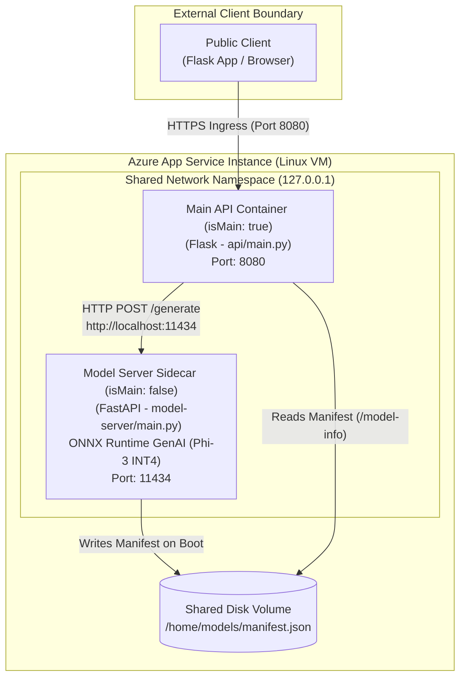

# Lab 04: Sidecar-Enabled AI Applications on Azure App Service

This directory contains the hands-on code, Dockerfiles, automation scripts, and local Flask chat client for deploying a sidecar-enabled AI application on Azure App Service.

---

## Architectural Flow



---

## Directory Layout

- `azdeploy.py`: Python automation script to provision ACR, build images via ACR Tasks, create User-Assigned Identity with `AcrPull`, and setup App Service resources.
- `sitecontainers-spec.template.json` / `sitecontainers-spec.json`: Declarative sitecontainers specification binding `chat-api:v1` (Port 8080) and `model-server:v1` (Port 11434).
- `api/`: Main API container code (`Flask`, `requests` calling `http://localhost:11434`).
- `model-server/`: Model sidecar server code (`FastAPI`, `onnxruntime_genai` running Phi-3 CPU INT4 model).
- `client/`: Local Flask web application serving the chat UI on `http://127.0.0.1:5000`.

---

## Quick Execution Steps

### 1. Register Resource Providers
```bash
az provider register --namespace Microsoft.ContainerRegistry
az provider register --namespace Microsoft.Web
```

### 2. Run Provisioning Script
```bash
python3 azdeploy.py
```
- Select Option 1 (Build ACR images - takes 5-10 minutes for Phi-3 model download)
- Select Option 2 (Create Managed Identity & AcrPull)
- Select Option 3 (Create App Service Plan & Web App)
- Select Option 4 (Check status)
- Select Option 5 (Exit)

### 3. Deploy Container Specification
```bash
source .env
az webapp sitecontainers create \
  --name "$APP_NAME" \
  --resource-group "$RESOURCE_GROUP" \
  --sitecontainers-spec-file ./sitecontainers-spec.json
```

### 4. Verify Sidecar Readiness
```bash
az webapp sitecontainers list --name "$APP_NAME" --resource-group "$RESOURCE_GROUP" --output table
az webapp sitecontainers log --name "$APP_NAME" --resource-group "$RESOURCE_GROUP" --container-name model-server
curl --fail-with-body "${CHAT_API_URL}/health/ready"
curl --fail-with-body "${CHAT_API_URL}/model-info"
```

### 5. Launch Local Flask Chat UI
```bash
cd client
python3 -m venv .venv
source .venv/bin/activate
pip install -r requirements.txt
python app.py
```
Open `http://127.0.0.1:5000` in your web browser.

