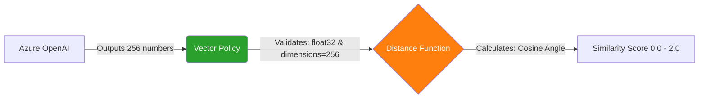
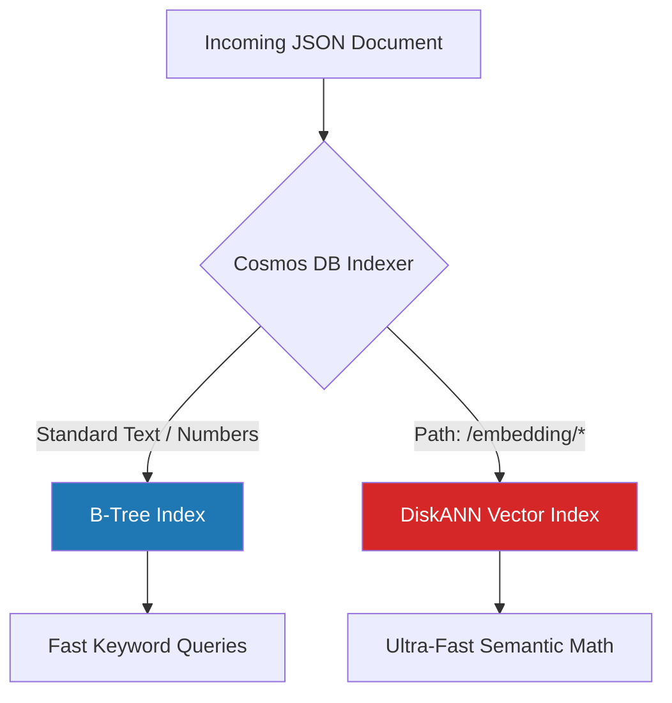

# Exam-Ready Guide: Semantic Search with Azure Cosmos DB

In this exercise, we transformed a standard Cosmos DB NoSQL database into an AI-powered Semantic Search engine. This guide breaks down the core concepts, architectural decisions, and code implementations critical for the **AI-200** and **DP-420** certifications.

---

## 1. The Core Concept: What is a Vector Embedding?

Traditional databases use **lexical search** (exact keyword matching). If a user searches for *"I can't login"*, a standard query misses documents containing *"Authentication failed"* because the words don't match.

**Semantic Search** solves this by converting text into an array of floating-point numbers called a **Vector Embedding**. The AI model scores the text across multiple **dimensions** (e.g., 256 dimensions), representing its mathematical *meaning*.

> [!IMPORTANT]
> **AI-200 Exam Concept:** Text with similar meanings will have vector arrays that are mathematically close to each other, regardless of the actual vocabulary used.

---

## 2. Infrastructure: Enabling Vector Search

By default, Cosmos DB NoSQL does **not** understand vector math. You must explicitly enable this capability at the account level.

```bash
# Enable Vector Search on an existing account
az cosmosdb update \
    --name $COSMOS_ACCOUNT_NAME \
    --resource-group $RESOURCE_GROUP \
    --capabilities EnableNoSQLVectorSearch
```

### The Security Trap (Control Plane vs. Data Plane)
In Lab 11, we used Entra ID (RBAC) with the `Cosmos DB Built-in Data Contributor` role. This role allows reading/writing data (Data Plane) but **denies** container creation (Control Plane). 

To create our Vector Container programmatically, we had to use the **Master Key** to bypass Entra ID restrictions.

---

## 3. Creating the Vector Container (The Secret Sauce)

To support semantic search, a container must be injected with two highly specific JSON policies at the moment of creation. Here is the exact Python code we used to configure them:

### A. The Vector Embedding Policy (The Math)
This defines the mathematical rules for how vectors are processed by the database.

```python
vector_embedding_policy = {
    "vectorEmbeddings": [
        {
            "path": "/embedding",         # 1. The JSON field holding the array
            "dataType": "float32",        # 2. High precision decimals
            "distanceFunction": "cosine", # 3. Math formula (angle between vectors)
            "dimensions": 256             # 4. Must exactly match the AI model output
        }
    ]
}
```

**Visualizing the Vector Math Flow:**


### B. The Indexing Policy (The Performance Engine)
Cosmos DB automatically indexes every property using a B-Tree index. A B-Tree will crash if forced to index a 256-number array.

```python
indexing_policy = {
    "indexingMode": "consistent",     # Sync index immediately
    "automatic": True,                # Index every new document automatically
    "includedPaths": [{"path": "/*"}],
    "excludedPaths": [{"path": "/embedding/*"}], # 🚨 CRITICAL: Skip standard indexing
    "vectorIndexes": [
        {
            "path": "/embedding",
            "type": "diskANN"         # 🚀 CRITICAL: Use Vector Index instead
        }
    ]
}
```

> [!WARNING]
> **Performance Critical:** You MUST exclude the vector path from standard indexing (`excludedPaths: ["/embedding/*"]`) and explicitly assign it a specialized Vector Index (`diskANN`). 

**Visualizing the Indexing Architecture:**


---

## 4. The Python SDK Implementation

We implemented three core functions to power the Semantic Search engine.

### Storing Vectors (`upsert_item`)
We inject the raw 256-number array directly into the JSON document before pushing it to the database.

```python
document = {
    "id": chunk_id,
    "documentId": document_id,
    "content": "User cannot access billing portal",
    "embedding": [0.12, -0.45, 0.89, ...], # 256 Dimensions
    "metadata": {"category": "billing"}
}
container.upsert_item(body=document)
```

### Semantic Search (`VectorDistance`)
We use the Cosmos DB specific `VectorDistance()` SQL function to calculate the **Cosine Similarity** between the user's search query and the database documents.

```sql
SELECT TOP 5 c.id, c.content, VectorDistance(c.embedding, @queryVector) AS similarityScore
FROM c
ORDER BY VectorDistance(c.embedding, @queryVector)
```
*Note: A distance of `0` is a perfect match, and `2` is a complete opposite. We order ascending to get the closest matches first.*

### Hybrid Search (Filtering + Vectors)
To optimize performance (RUs), we combine traditional SQL `WHERE` clauses with Vector Math. 

```sql
SELECT TOP 5 c.id, c.content, VectorDistance(c.embedding, @queryVector)
FROM c
WHERE c.metadata.category = 'billing'
ORDER BY VectorDistance(c.embedding, @queryVector)
```
> [!TIP]
> **DP-420 Exam Concept:** Hybrid Search is vastly more efficient because the database filters down the dataset using the standard index *before* performing heavy vector math on the remaining items.

---

## 5. Running the Application (Lab Execution)

To see this all in action, follow these steps to run the Semantic Search engine locally:

### Step 1: Authenticate the Environment
Ensure your terminal has access to the Cosmos DB Master Key (needed for control-plane container setup).
```bash
export COSMOS_KEY=$(az cosmosdb keys list --name $COSMOS_ACCOUNT_NAME --resource-group $RESOURCE_GROUP --type keys --query primaryMasterKey -o tsv)
```

### Step 2: Start the Flask Backend
Activate your Python environment and start the application.
```bash
source .venv/bin/activate
python3 app.py
```

### Step 3: Test Semantic Search
1. Open your browser to **http://127.0.0.1:5000**
2. Click **"Load Vector Data"** to automatically parse and upload the sample JSON support tickets alongside their AI vector embeddings.
3. Go to the **Vector Similarity Search** tab.
4. Search for: *"I can't login to my account"*
5. Observe how Cosmos DB returns the ticket *"Authentication failed for user account"* despite having zero matching vocabulary words!
